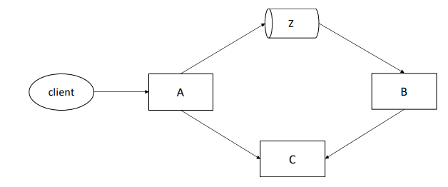

# Progetto Architettura dei sistemi software

Progetto per il corso Architettura dei sistemi software tenuto dal Prof. Luca Cabibbo per l'A.A. 2018/2019, relativo alla sperimentazione pratica di alcune tecnologie studiate.

Riguarda la realizzazione di una semplice applicazione distribuita, composta da tre servizi ai quali possono essere associati diversi profili, nonché il rilascio di questa applicazione in un opportuno ambiente di esecuzione distribuito (Docker).

Terna di servizi A, B e C, che comunicano tra loro  tramite invocazioni remote con REST e 
comunicazione asincrona con Kafka. Per ciascun servizio possono esserci più istanze in esecuzione, 
ciascuna con un proprio nome (ad esempio, Alice, Barbara e Carlo). 

Un servizio principale A, che può ricevere richieste da un client HTTP/REST esterno, per le 
operazioni POST / e GET /.  

Un servizio secondario B, che è un ascoltatore di messaggi dal canale Z.

Un  servizio  secondario  C,  che  può  ricevere  richieste  da  un  client  HTTP/REST,  per  le 
operazioni POST / e GET /.  



## Tecnologie utilizzate:

 * Spring Boot/Spring Cloud.  
 * Kafka
 * Eureka(service  discovery)
 * Ribbon  e  Feign  (per le chiamate rest)
 * Zuul (per esporre il servizio offerto da A sulla porta 8080 di localhost).

## Startup

```
run build-all-projects.sh
```

### Locale

start Kafka cluster first:
```
run kafka/start-kafka.sh
```

then:
```
run-all.sh
```

a fine esecuzione:

```
run stop-java-processes.sh
run kafka/stop-kafka.sh
```

### Docker

```
docker-compose up --build
```

### Client

N.B. una volta aver eseguito il docker compose è bene attendere qualche secondo per far si che tutti i servizi possano registrarsi adeguatamente, prima di eseguire il client:

```
run sightings-client.sh
```

Inoltre sono state esposte le porte:
 * http://localhost:8761 -- per visualizzare i servizi registrati presso eureka
 * http://localhost:8080/ -- tramite API-Gateway è presente una pagina HTML, per visualizzare la lista memorizzata dal servizioC corrispondente, cliccando su 'visualizza'.

Per ogni servizio è possibile eseguire più stanze dello stesso.

